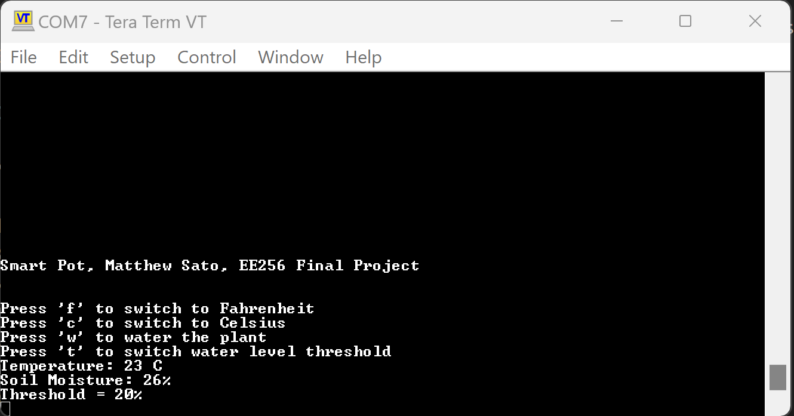
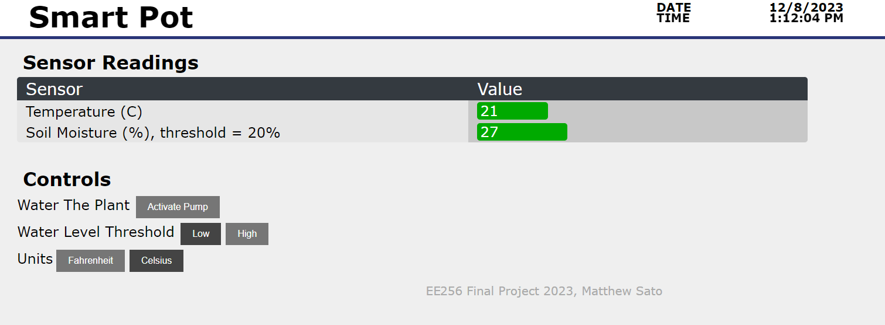

# EE 256 Project --- The Smart Pot
Matthew Sato  
satomm@stanford.edu  
Autumn 2023

This repository contains three folders: [`electrical`](electrical), [`software`](software), and [`docs`](docs) which contain all the project deliverables for this project. The project summary with my perspectives on this project is located at the [bottom of this page](#project-summary).

## The Smart Pot
The smart pot is designed as a completely autonomous plant pot that gives you the ability to be a plant parent without the trouble of remembering to water it on a regular basis. It gives water to the plant when it actually is thirsty. Now you can travel without being worried about watering your plant!

### Features of the Smart Pot
- Senses the ambient air temperature and soil moisture of the plant
- Automatically pumps water into pot when soil moisture drops too low
- Sensor to indicate when the water reservoir is low
- Display to show the temperature
- Ability to change temperature units, activate pump manually, and change the threshold at which the pump is activated
- Serial desktop interface and web-based HTML interface
- The features are fully integrated across the board, serial interface, and webpage. Any update in setting in one of these interfaces results in the corresponding update to the other interfaces.

### Implementation Details of the Smart Pot
- The Smart Pot is built on a PCB and is under the control of a PIC32 microcontroller
- Temperature sensing is performed via a thermistor
- Soil moisture sensing is performed with two probes manufuctured on a PCB
- The water tank sensor is a limit switch which is activated by a plunger when the water is too low
- The WiFi capability is added with an ESP32 and communicates with the PIC32 via SPI
- Powered with a 5 V DC barrel jack
- A 7 segment display implemented with shift registers and SPI
- 2x UART to USB bridges to allow serial communication with a desktop machine

### More Details
To learn more about the product, visit the following folders:
1. [`docs`](docs/): contains the product brief, product requirements, product design document, bill of materials, bringup plan, and unit tests document
2. [`electrical`](electrical/): contains the detailed KiCad schematic and PCB layout
3. [`software`](software/): contains the software for the Smart Pot

### Instruction Manual
The fully functional board appears as follows:

A. The power supply barrel jack. Insert 5V DC only.  
B. The display for the product. Can show temperature in F/C, or the soil moisture percentage  
C. The function button. Short pressing once will switch the watering frequency to between the low threshold and the high threshold. A long press will activate the pump. A double press activates selection mode. In selection mode, you can click the button to select Fahrenheit units, Celsius Units, or Soil Moisture to display. After 5 seconds of inactivity in selection mode, the display will show the desired quantity. 
D. The serial output. Connect this USB-Micro port to your computer and see the current data using a baud rate of 115200. I recommend TeraTerm, and the proper driver for a CP2102 USB-UART driver must be installed on your machine. The output looks like the following:

E. These two LEDs indicate if the low soil moisture threshold or high soil moisture threshold are selected. 
F. This blue LED indicates when your water tank is low:

G. The port for the pump 
H. The ports for the soil moisture probes. The probes should be placed in the pot approximately one inch apart:

I. The ports for the water tank level sensor. The sensor can be mounted as follows:

The unit should be turned on for approximately 5 minutes before a reliable temperature can be maintained.

All data can also be viewed on a web browser:

# Project Summary
- In retrospect, why you found this project compelling and was the scope of the project comfortable.
    - I liked that this project allowed us to design a product from start to finish. Going through the design process and how this influences the eventual circuit and PCB design was very informative.
    - I thought the scope of the project was fine, just a little more time at the end would have been nice.
- What were the areas that you learned the most.
    - I learned how to design a circuit from start to finish, including choice of parts. Selecting a part from DigiKey can be daunting, but this project helped me learn how to do this.
    - I also learned a lot from the board bringup --- how to test if things are working, and how to fix poorly soldered joints with a heat gun.
- What are you proud of about the project.
    - After taking ME218, I felt confident about my ability to program a microcontroller to do useful tasks. I am proud that I was able to transfer the skills to the PCB using a slightly different microcontroller and now feel like my capabilities are much larger than before.
- What might you do differently.
    - I would have not used any QFN packages in my design --- these are hard to solder!
    - I would have spent more time doing floor planning in the PCB design before routing the copper.
- Now that you know how to build a PCB based system, what might you want to attempt next?
    - I plan to use my PCB knowledge to design PCBs for my research project(s), including the design of a low-level controller for a mobile robot.
