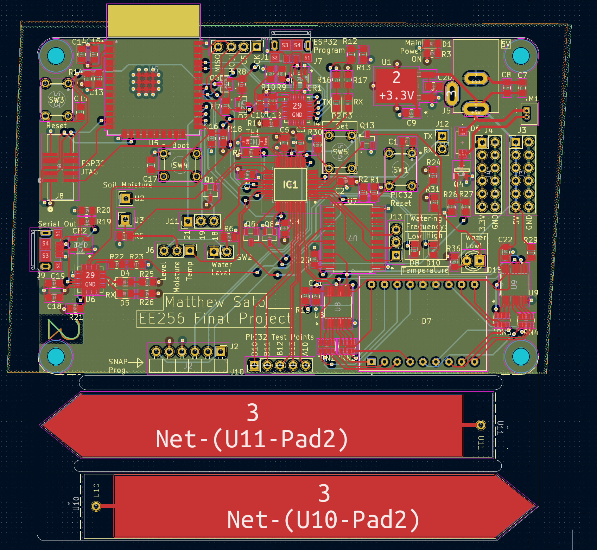

# Electrical Design

This folder contains the electrical schematic and PCB layout of the project. The project is available as a KiCad file.

My board produces the soil moisture probes on the PCB. These are cut from the PCB after production via a notcher.

3D View of PCB:

PCB Layout:
