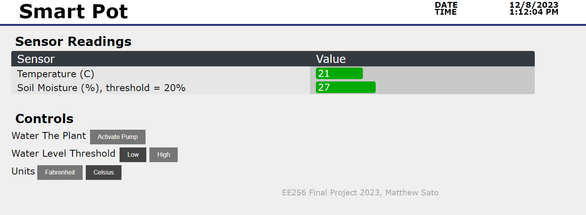
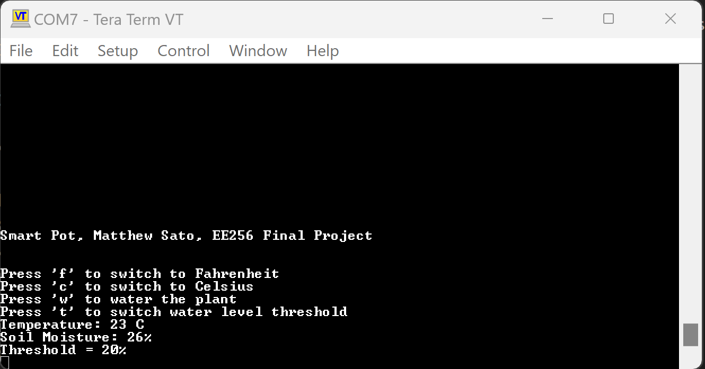

# Software

This repo contains software for the PIC32 main microcontroller, as well as the ESP32 WiFi coprocessor.

## PIC32

The PIC32 is programmed with MPLAB X in C. An event driven framework is used. State machines are used to manage the different components of the board:
- USB Serial Output
- 7 Segment Display
- Pump
- Soil Moisture
- Temperature
- User Button Debouncer
- Water Button Debouncer
- WiFi communications

## ESP32
The ESP32 is programmed with the Arduino IDE. The ESP32 acts as a WiFi server which can update HTML webpages by sending XML messages with updated data.

Webpage Monitoring:

Serial Out Monitoring:

